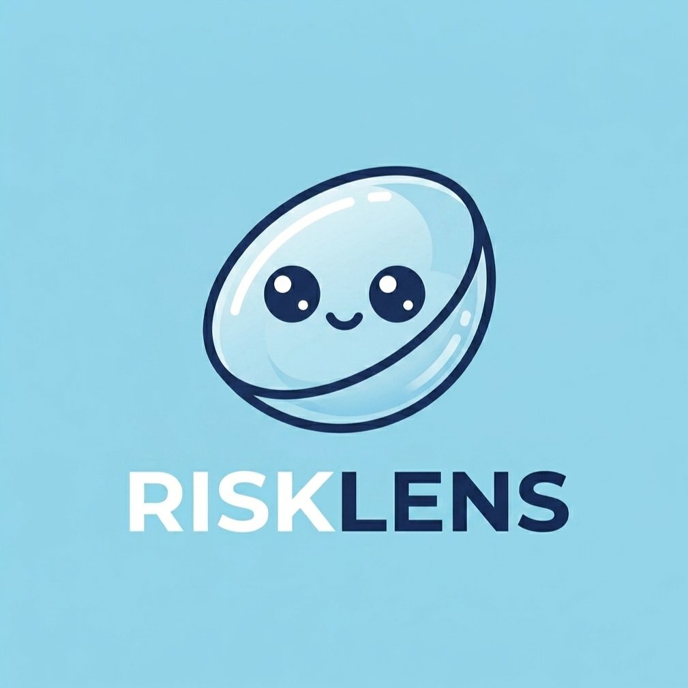

<div align="center">


<br><br>


</div>

---

## 📌 About RISKLENS

<p align="center">
  
</p>

RISKLENS는 브랜드 및 연관 인물의 온라인 평판 리스크를 분석하는 AI 기반 통합 모니터링 플랫폼입니다.

온라인상에서 생성되는 다양한 데이터를 수집하고 분석하여 브랜드에 영향을 줄 수 있는 위험 신호를 조기에 탐지하고, 보다 빠른 대응이 가능하도록 지원합니다.

---

## 📌 프로젝트 개요

기업의 브랜드 가치는 제품 경쟁력뿐 아니라 **소비자 인식과 평판**에 의해 크게 영향을 받습니다.

최근 SNS와 온라인 커뮤니티를 중심으로 부정적 이슈가 빠르게 확산되면서 브랜드 이미지 훼손, 매출 감소, 불매 운동 등의 리스크가 증가하고 있습니다.

**RISKLENS**는 이러한 온라인 여론을 분석하여 브랜드 및 연관 인물의 위험 신호를 조기에 탐지할 수 있도록 설계된 AI 기반 분석 플랫폼입니다.

---

## ✨ 주요 기능

| 기능                  | 설명                                            |
| ------------------- | --------------------------------------------- |
| 🏷️ **브랜드 리스크 분석**  | 온라인 데이터 수집 · Risk Score 산출 · 감성 분석 · 핵심 이슈 탐지 |
| 👤 **연관 인물 리스크 분석** | CEO · 광고 모델 · 홍보 인물 등 연관 인물의 평판 리스크 분석        |
| 🤖 **AI 리포트 생성**    | 브랜드 현황 요약 · 위험 요인 분석 · 대응 전략 초안 자동 생성         |
| 📊 **대시보드 시각화**     | 감성 비율 · 위험도 게이지 · 플랫폼별 위험도 비교 · 이슈 모니터링        |
| 📄 **PDF Export**   | 분석 결과 PDF 저장                         |

---

## 🌐 데이터 수집 채널

```text
Naver          YouTube         Instagram
─────────      ─────────       ─────────
뉴스            영상 메타데이터    게시글
블로그           댓글             댓글
카페
```

> 분석 요청 시 최신 데이터를 수집하는 **On-Demand** 방식으로 동작합니다.

---

## 🧠 AI 분석 파이프라인

```
데이터 수집
    │
    ▼
KoBERT 감성 분석
    │
    ├── score ≥ 0.6 ──▶ 결과 사용
    │
    └── score < 0.6 ──▶ GPT-4o-mini 재분석
                              │
                              ▼
                        최종 감성 분류
                              │
            ┌─────────────────┴─────────────────┐
            ▼                                   ▼
       핵심 이슈 분석                      행동 의도 분석
```

---

## 🛠️ 기술 스택

<table>
  <tr>
    <td align="center"><b>Frontend</b></td>
    <td>React · Vite · Tailwind CSS · Axios · Recharts · Framer Motion</td>
  </tr>
  <tr>
    <td align="center"><b>Backend</b></td>
    <td>FastAPI · Python</td>
  </tr>
  <tr>
    <td align="center"><b>Database</b></td>
    <td>MySQL · SQLAlchemy · PyMySQL</td>
  </tr>
  <tr>
    <td align="center"><b>AI</b></td>
    <td>KoBERT · GPT-4o-mini · Transformers · PyTorch · Scikit-Learn</td>
  </tr>
</table>

---

## 📁 프로젝트 구조

```text
Brand_Risk_Platform/
├── Front/
│   ├── src/
│   ├── public/
│   └── package.json
│
├── Backend/
│   ├── routers/
│   ├── services/
│   ├── utils/
│   ├── models.py
│   ├── database.py
│   └── requirements.txt
│
├── docs/
└── README.md
```

---

## 💡 기존 서비스와의 차별점

기존 브랜드 모니터링 서비스가 **언급량**과 **키워드 빈도** 중심의 분석을 제공한다면, RISKLENS는 한 단계 더 나아가 소비자의 반응을 보다 깊이 분석하는 데 초점을 맞추고 있습니다.

```text
언급량 분석  →  감성 분석  →  행동 의도 분석  →  대응 전략 제안
```

* 소비자의 **감정과 행동 의도**까지 분석
* **연관 인물 리스크**를 브랜드와 함께 모니터링
* AI가 **대응 전략 초안**까지 자동 생성

---

## 👩‍💻 Developer

<div align="center">

**Watch.i | Computer Science**

`20220008 김소현`

</div>


